# Rapport TAI (Chaînes de Markov)

CONSIGNES :

Un rapport est demandé pour chacune des équipes qui fera au maximum 16 pages, i.e. environ 4
pages par partie :
1.La forêt des Landes
2.Écosystèmes méditerranéens
3.Modèle plus riche d’écosystème
4.Pour aller plus loin
La notation tiendra compte de la qualité des courbes présentées, la concision des réponses ainsi que
des interprétations.
Le dépôt de votre rapport se fera sur Moodle jusqu’au samedi 2 décembre à 23h59. Aucun délais
supplémentaire ne pourra être accepté.

## 1. La forêt des Landes : modèle à 3 état

1\) Comment se traduisent ces informations sur la matrice P telle que nous l’avons définie, possédant
la propriété de Markov ?

$X_{n}
=\left(\begin{array}{cc} Rs\\ Ch\\ Cht\\ \end{array}\right)_{n}
= \left(\begin{array}{cc} 1\\ 0\\ 0\\ \end{array}\right)$

$X_{n+1}
=\left(\begin{array}{cc} Cht\\ Ch\\ Rs\\ \end{array}\right)_{n+1}
= \left(\begin{array}{cc} 0,5\\ 0,2\\ 0,3\\ \end{array}\right)$

<br />
<br />
<br />

$\{a, b, c, d, e, f\} \in R^6$

$P*X_{n}
=\left(\begin{array}{cc} 0,5 &a &b\\ 0,2 &c &d\\ 0,3 &e &f\\ \end{array}\right).\left(\begin{array}{cc} 1\\ 0\\ 0\\ \end{array}\right)
= \left(\begin{array}{cc} 0,5\\ 0,2\\ 0,3\\ \end{array}\right)
= X_{n+1}$

Donc $P=\left(\begin{array}{cc} 0,5 &a &b\\ 0,2 &c &d\\ 0,3 &e &f\\ \end{array}\right)$

---
2\) Dessiner un graphe qui modélise l’écosystème. On précisera notamment les valeurs sur chacun
des arcs.

$P = \left(\begin{array}{cc} 0,5 &0,1 &0,1\\ 0,2 &0,6 &0,2\\ 0,3 &0,3 &0,7\\ \end{array}\right)$

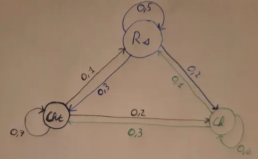

---
3\) Calculez la proportion de chaque arbre pour l’année n = 1.

$X_1 = P.X_0 = \left(\begin{array}{cc} 0,5 &0,1 &0,1\\ 0,2 &0,6 &0,2\\ 0,3 &0,3 &0,7\\ \end{array}\right).\left(\begin{array}{cc} 0,36\\ 0,40\\ 0,24\\ \end{array}\right) = \left(\begin{array}{cc} 0,24\\ 0,36\\ 0,40\\ \end{array}\right)$

---
4 & 5\) A l’aide d’un ordinateur, calculez la proportion de chaque arbre pour n = 20.

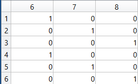

On peut donc en déduire que l'écosystème tend vers la stabilité. Il précisément, il tend vers cette valeur :

$X_{20} = \left(\begin{array}{cc} 0,16\\ 0,33\\ 0,50\\ \end{array}\right)$

---
6\) Diagonalisation de $P$:

$D = \left(\begin{array}{cc} 1 &0 &0\\ 0 &2/5 &0\\ 0 &0 &2/5 \end{array}\right)$ Chaque élément non nul est une valeur propre de D

$A = \left(\begin{array}{cc} 1/3 &-1 &-1\\ 2/3 &1 &0\\ 1 &0 &1\\ \end{array}\right)$ La première colonne est le vecteur propre de la première valeure de D et ainsi de suite.

$A^{-1} = \left(\begin{array}{cc} 1/2 &1/2 &1/2\\ -1/3 &2/3 &-1/3\\ -1/2 &-1/2 &1/2 \end{array}\right)$ 

$P = A.D.A^{-1}$

---
7\) Écrire le vecteur $X_n$ en fonction de $D_n$, $A$, $A^{−1}$ et la distribution initiale $X_0$

$X_n = X_0.(A.D_n.A^{−1})^T$

Avec matlab nous obtenons l'exact même résultat qu'à l'exercice 5.


## 2. Ecosystèmes méditerranéens à 5 états
1\) Dessiner le graphe relatif à ce modèle.
    
2\) Quelle est, selon ce modèle, la probabilité que l’on passe de l’état Pi à Pe, d’une année sur
l’autre ? 

$P_i-P_e = 0.25$

---
Et de l’état $P_e$ à $P_i$ ? 
$Pe-Pi = 0$ car en une année, $Pe$ ne peut que passer à $G_a$ ou rester à $P_e$.

3\) Sachant que l’on est dans l’état Pi, quelle est la probabilité d’une trajectoire du type Pi−Pe−Ga ?

$P((P_e \cap G_a)\setminus P_i) = P(P_e \setminus P_i)*P(Ga\setminus P_e)
= 0.25\times 0.6 =0.15$

Et d'une trajectoire du type Pi−C −V ?

$P((C\cap V)\setminus P_i) = P(C \setminus P_i)*P(V\setminus C)=0.2\times 0.1=0.02$

---
4\) Donnez un exemple de trajectoire de probabilité nulle.

$Pi-V-Ga$

---
5\) En vous servant de votre cours d’Algèbre linéaire de L1 expliquez, lorsque n tend vers l’infini,
vers quelle proportion tend la dynamique lorsque
$X_{0} =\left( \begin{matrix} C \\ V \\ Pe \\ Ga \\ Pi \end{matrix}\right )_{0}=0,2\times \left ( \begin{matrix} 1 \\ 1 \\ 1 \\ 1 \\ 1 \end{matrix}  \right )$

---
6\) La transition de Pi vers Pe mime la présence des incendies. Étudier l’influence aux temps longs
des incendies, en faisant varier sa valeur dans la matrice.

La valeur initiale est $P_i-P_e = 0.25$ et pour cette valeur : $X_n= \left( \begin{matrix} 0.1752\\ 0.1168\\ 0.2044\\ 0.1533\\ 0.3504 \end{matrix}\right )$

Si $Pi-Pe = 0$ alors $Xn=10^{-6} \times \left ( \begin{matrix}  0.7431 \\ 0.6639 \\ 0.3802 \\ 0.3151 \\  0.9205 \end{matrix}  \right )$

Si $Pi-Pe = 0.1$, $Xn=10^{-3} \times \left ( \begin{matrix} 0.0668 \\ 0.0533 \\ 0.0473 \\ 0.0378 \\ 0.1006\end{matrix}  \right )$
    
Si $Pi-Pe = 0.4$, $Xn=10^{3} \times \left ( \begin{matrix} 0.4955 \\ 0.2809 \\ 0.8967 \\ 0.6309 \\  1.2529\end{matrix}  \right )$

Si $Pi-Pe = 0.6$, $Xn=10^{7} \times  \left ( \begin{matrix} 0.5804 \\ 0.2772 \\ 1.6602 \\ 1.0842 \\  1.8503\end{matrix}  \right )$

Si $Pi-Pe = 0.8$, $Xn=10^{10} \times  \left ( \begin{matrix} 1.4725 \\ 0.6174 \\ 5.9537 \\3.6564 \\  5.5508\end{matrix}  \right )$

On remarque que $X_n$ devient plus grand quand $P_i-P_e$ devient plus grand. On peut en déduire que les incendies entraînent plus d'arbres sur le long terme et à l'inverse, pas d'incendies réduit le nombre d'arbres sur le long terme.
    

## 3. Modèle plus riche d’écosystème

$P= \left(\begin{array}{cc} 
0.1& 0& 0.8& 0& 0.2& 0& 0& 0& 0& 0& 0& 0& 0& 0& 0& 0& 0& 0& 0& 0\\
0.2& 0.4& 0.05& 0& 0& 0& 0& 0& 0& 0& 0& 0& 0& 0& 0& 0& 0& 0& 0& 0\\
0.1& 0.2& 0.05& 0.9& 0.1& 0& 0& 0& 0& 0& 0& 0& 0& 0& 0& 0& 0& 0& 0& 0\\
0.5& 0.2& 0.05& 0.05& 0& 0& 0& 0& 0& 0& 0& 0& 0& 0& 0& 0& 0& 0& 0& 0\\
0.1& 0.2& 0.05& 0.05& 0.7& 0& 0& 0& 0.2& 0& 0& 0& 0& 0& 0& 0& 0& 0& 0& 0\\
0& 0& 0& 0& 0& 0& 0& 1& 0& 0& 0& 0& 0& 0& 0& 0& 0& 0& 0& 0\\
0& 0& 0& 0& 0& 1& 0& 0& 0& 0& 0& 0& 0& 0& 0& 0& 0& 0& 0& 0\\
0& 0& 0& 0& 0& 0& 1& 0& 0& 0& 0& 0& 0& 0& 0& 0& 0& 0& 0& 0\\
0& 0& 0& 0& 0& 0& 0& 0& 0.6& 0.4& 0.1& 0& 0& 0& 0& 0& 0& 0& 0& 0\\
0& 0& 0& 0& 0& 0& 0& 0& 0.1& 0.2& 0.7& 0& 0& 0& 0& 0& 0& 0& 0& 0\\
0& 0& 0& 0& 0& 0& 0& 0& 0.1& 0.2& 0.1& 0& 0& 0& 0& 0& 0& 0& 0& 0\\
0& 0& 0& 0& 0& 0& 0& 0& 0& 0& 0& 1& 0& 0& 0& 0& 0& 0& 0& 0\\
0& 0& 0& 0& 0& 0& 0& 0& 0& 0& 0.1& 0& 0.3& 0.3& 0.3& 0.4& 0.1& 0.3& 0& 0.15\\
0& 0& 0& 0& 0& 0& 0& 0& 0& 0& 0& 0& 0.3& 0.05& 0.3& 0.1& 0.1& 0.1& 0.2& 0.05\\
0& 0& 0& 0& 0& 0& 0& 0& 0& 0& 0& 0& 0.1& 0.1& 0& 0.1& 0.1& 0.1& 0.1& 0.1\\
0& 0& 0& 0& 0& 0& 0& 0& 0& 0& 0& 0& 0.1& 0.1& 0.1& 0.1& 0.1& 0.1& 0.15& 0.05\\
0& 0& 0& 0& 0& 0& 0& 0& 0& 0& 0& 0& 0.1& 0.1& 0.1& 0.1& 0.1& 0.1& 0.05& 0.05\\
0& 0& 0& 0& 0& 0& 0& 0& 0& 0& 0& 0& 0.1& 0.1& 0& 0.1& 0.2& 0.1& 0.2& 0.3\\
0& 0& 0& 0& 0& 0& 0& 0& 0& 0& 0& 0& 0& 0.2& 0.1& 0.05& 0.2& 0.1& 0.1& 0.2\\
0& 0& 0& 0& 0& 0& 0& 0& 0& 0.2& 0& 0& 0& 0.05& 0.1& 0.05& 0.1& 0.1& 0.2& 0.1\\
\end{array}\right)$

---
1\) A partir de chaque état, le ou lesquels sont à un moment ou un autre visités ? Donner alors les groupes d’états qui communiquent tous ensemble. Expliquer comment cela se voit sur la matrice. 

Tous sont visités sauf le 12e élément. Le 1er au 4e communiquent ensemble, le 6,7 et 8e, communiquent entre eux. Les 13 à 20 aussi. La 5e ligne communique avec les 1,3,5 et est visitee par le 7e element. Les 9,10 et 11 communquent entre elles, la 10 visite la 20 et la 11 visite la 13.
 Il faut regarder les lignes pour regarder quel élément est visité et les colonnes pour regarder les éléments que visite celui sur lequel on est.

---
2\) Calculs de $X_{1}$, $X_{2}$, $X_{50}$ avec matlab :

$X_{0} = 1/16 \times \left(\begin{array}{cc} 1 &1 &1 &1 &1 &0 &0 &0 &1 &1 &1 &0 &1 &1 &1 &1 &1 &1 &1 &1 \end{array}\right)$

$X_{1} = \left(\begin{array}{cc} 0.0688 &0.0406 &0.0844 &0.0500 &0.0813 &0 &0 &0 &0.0688 &0.0625 &0.0250 &0 &0.1219 &0.0750 &0.0438 &0.0500 &0.0438 &0.0688 &0.0594 &0.0563 \end{array}\right)$

$X_{2} = \left(\begin{array}{cc} 0.09060 &0.03420 &0.07230 &0.04920 &0.09230 &0 &0 &0 &0.06880 &0.03690 &0.02190 &0 &0.1281 &0.08440 &0.04750 &0.05200 &0.04610 &0.06910 &0.05470 &0.05190 \end{array}\right)$

$X_{50} = \left(\begin{array}{cc} 0.1084 &0.04440 &0.09850 &0.07160 &0.09410 &0 &0 &0 &0 &0 &0 &0 &0.1459 &0.09710 &0.05300 &0.05920 &0.05320 &0.07270 &0.06000 &0.04190 \end{array}\right)$

Il faut en moyenne un seul pas pour que toutes les valeurs soient concentrées sur les états {1, 2, 3, 4, 5}, {13, 14, 15, 16, 17, 18, 19, 20}

---
3\) Simulation des états de $Y_{n}$ par rapport à $n$ :

$Y_{0} = \left(\begin{array}{cc} 0 &0 &0 &0 &0 &0 &0 &0 &0 &0 &1 &0 &0 &0 &0 &0 &0 &0 &0 &0 \end{array}\right)$

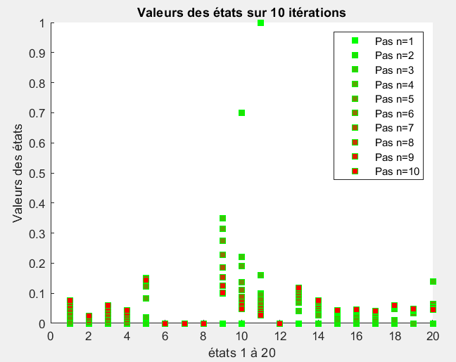

Nombre de pas moyen pour que le système peuple les états {1, 2, 3, 4, 5} : 

Nombre de pas moyen pour peupler que le système états {14, 15, 16, 17, 18, 19, 20} :

---
4\) Simulation des états de $Z_{n}$ par rapport à $n$ :

$Z_{0} = \left(\begin{array}{cc} 0 &0 &0 &0 &0 &0 &0 &0 &0 &0 &0 &1 &0 &0 &0 &0 &0 &0 &0 &0
 \end{array}\right)$

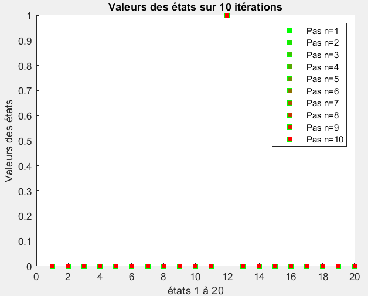

---
5\) Simulation des états de $A_{n}$ par rapport à $n$ :

$A_{0} = \left(\begin{array}{cc} 0 &0 &0 &0 &0 &1 &0 &0 &0 &0 &0 &0 &0 &0 &0 &0 &0 &0 &0 &0
 \end{array}\right)$

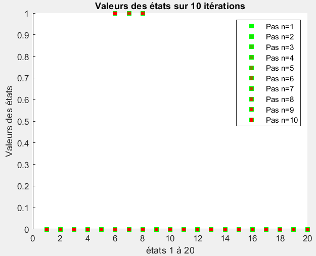


## 4. Pour aller plus loin

1\) On remarque que la matrice correspond à une matrice de transition.<br />
On rappelle que le nombre de colonne correspond nombre d'état qu'on appellera k.
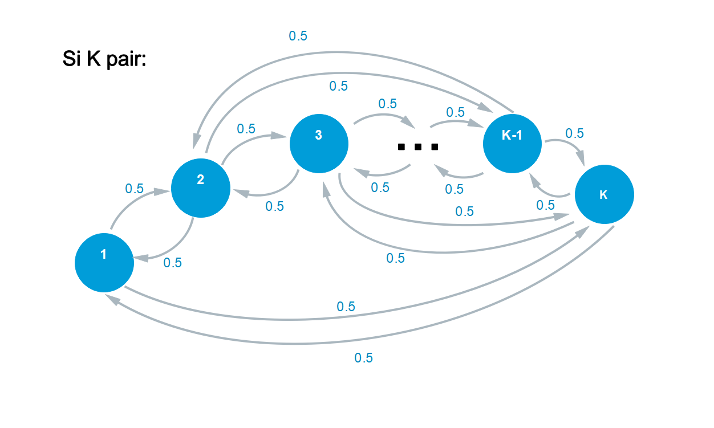
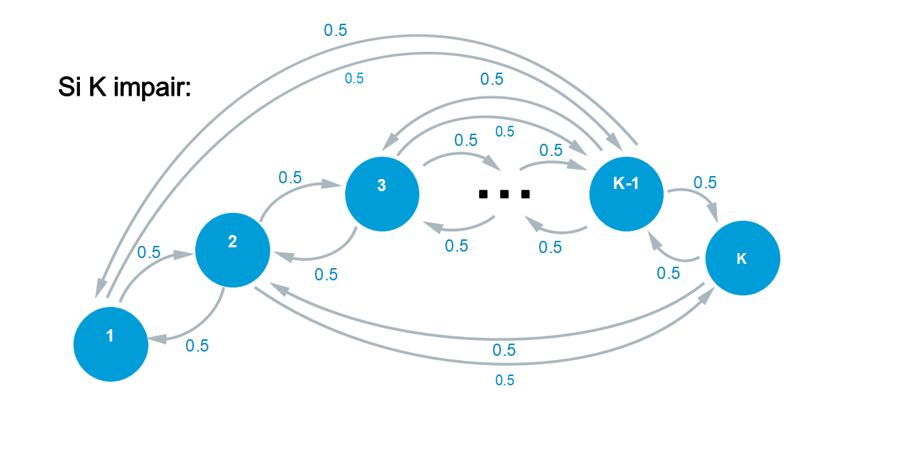

2\) On peut expliciter $X_n tel que:<br />
$X_n = $X_0.P^n

Pour faire la simulation numérique, nous avons utilisé python avec la bibliothère de mathlab:

```
import numpy as np
import matplotlib.pyplot as plt

# Définir la taille de la chaîne n et le nombre de pas k
k = 100
n = 200

# Matrice de transition P pour une chaîne de Markov
P = np.zeros((k, k)) #on remplit une matrice de 0
#on fait une double boucle pour parcourir la matrice et attribuer les valeurs correspondantes
for i in range(k):
    for j in range(k):
        if i % 2 != 0:
            if j%2==0:
                P[i, j] = 0.5
            else:
                P[i, j] = 0
        elif  i % 2 == 0:
            if j%2!=0:
                P[i, j] = 0.5
            else:
                P[i, j] = 0
        else:
            P[i, j] = 0

#on crée d'abord X0
XO = np.zeros(k) #X0 est un vecteur remplit de 0
#on lui attribut les valeurs correspondantes
for i in range(k):
    if i%2!=0:
        XO[i]=0
    else:
        XO[i]=1
#Nous allons mettre P à la puissance n
Pn = np.copy(P) #on copie P à Pn
#on crée une boucle pour multiplier pn n fois à p
#sa correspond à P puissance n
for a in range(n):
    Pn = np.dot(Pn,P)

# On crée Xn
Xn=np.dot(Pn,XO) #on fait la matrice Pn.X0 et l'attribut à Xn

# Affichage de Xn en fonction de n
plt.figure(figsize=(8, 6))
plt.plot(Xn)
plt.title('Valeurs de Xn en fonction de n')
plt.xlabel('n')
plt.ylabel('Valeurs de Xn')
plt.grid(True)
plt.show()

# Représentation de la distribution X200
plt.figure(figsize=(8, 6))
plt.hist(Xn, bins=20, edgecolor='black')
plt.title('Distribution X200')
plt.xlabel('Valeurs')
plt.ylabel('Fréquence')
plt.grid(True)
plt.show()
```

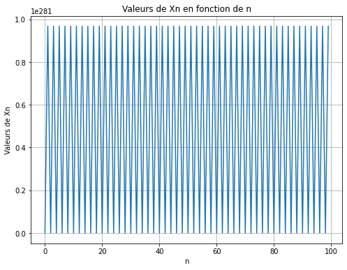
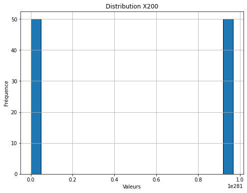

​Les probabilités de transition entre les paires sont égales, c'est le cas aussi pour les impaires entre-eux. Alors, entre les paires et entre les impaires, ils ont une chance égale d'être atteint après un grand nombre d'itérations. Par conséquent, cela suggère que la distribution des probabilités à X200 converge vers une distribution uniforme distinguer selon si ils sont paires ou impaires.
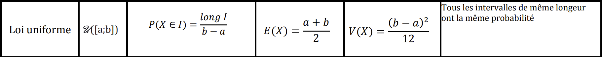

On peut l'approximer à une loi normale
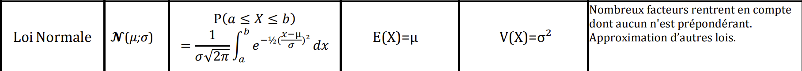
On peut, en réalité, en distinguer 2 avec des paramètres différents. Les états paires et impaires.<br />
Ils ont alors la même variance mais pas la même moyenne:

Moyenne pour les états paires: μ= k/2<br />
Moyenne pour les états impaires: μ= (k/2)-1<br />
​Variance: σ²= k²/12<br />

Pour X200:<br />
Moyenne pour les états paires: μ= 100/2 = 50<br />
Moyenne pour les états impaires: μ= (100/2)-1 = 49<br />
​Variance: σ²= k²/12 = 100²/12 = 833.33
